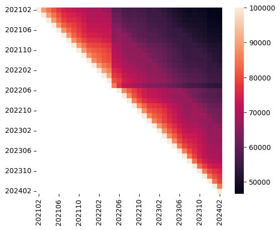

# crux_evolution

Just a quick heatmap visualization of how many origins stay in the top 100k of
different CrUX top lists across months.



Note: trend change for `202205.csv` is due to the fact that this CrUX top list
is incomplete and contains less than 1M records: [issue linked here](https://github.com/zakird/crux-top-lists/issues/5)

## Usage


A `Dockerfile` is provided under `.devcontainer/`; for direct integration with
VS Code or to manually build the image and deploy the Docker container, follow
the instructions in this [guide](https://gist.github.com/yohhaan/b492e165b77a84d9f8299038d21ae2c9).

Execute `./crux_evolution.sh` to get heatmap for top 100k, refer to the
`heatmap.py` Python script for more:

```
usage: python3 heatmap.py [-h] crux_dir {1000,5000,10000,50000,100000,500000,1000000}

Heatmap visualization of stability of origins from top specified `rank` across time in CrUX

positional arguments:
  crux_dir
  {1000,5000,10000,50000,100000,500000,1000000}

```

