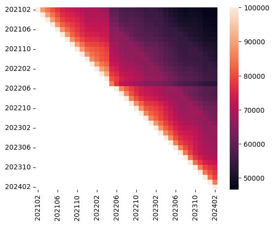

# crux_evolution

Just a quick heatmap visualization of how many origins stay in the top 100k of
different CrUX top lists across months.

## Usage

A `Dockerfile` is provided under `.devcontainer/`; for direct integration with
VS Code or to manually build the image and deploy the Docker container, follow
the instructions in this [guide](https://gist.github.com/yohhaan/b492e165b77a84d9f8299038d21ae2c9).

`./crux_evolution.sh`
